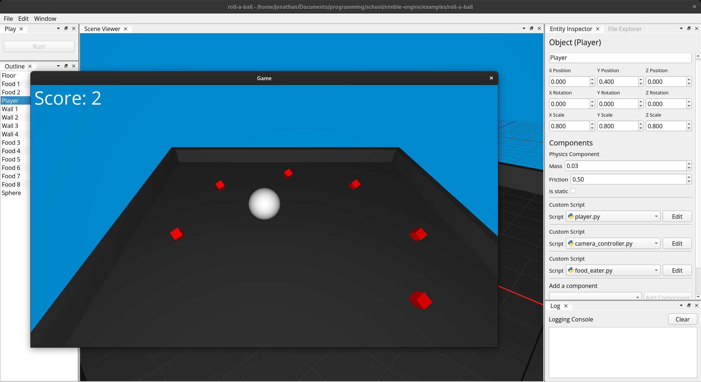

<p align="center">
    </img>
</p>
<h1 align="center">Nimble Engine</h1>

<br>

Nimble is a basic 3d game engine written in python. 
It renders the 3d models (and game) using low level [GLSL shaders](./nimble/resources/shaders/) (with 
OpenGL), uses Pybullet for physics, and Qt5 for the UI.

Before you ask: *yes*, I know, this is probably not suitable for super-serious 
games because of CPython's poor performance. It's more for learning purposes, like pygame is.

<br>

## example


**Demo of the roll-a-ball game, located in [`examples/roll-a-ball`](./examples/roll-a-ball).** To 
try it, open the `project.nimproj` file in nimble, using the `File > Open` menu.

<br>

## running

The easiest way to try nimble is to download the packaged binaries, found in the [releases page](https://github.com/MonliH/nimble-engine/releases).

<br>

## running from source

You will need:

* Python (3.9+)
* Conda (preferably Miniconda, as the pyqt5 packaged with Anaconda is not compatible with some dependencies)

Download the source either through github zip, or:
```bash
git clone https://github.com/MonliH/nimble-engine.git
cd nimble-engine
```

Activate a conda environment, for example `base`:

```bash
conda activate base
```

Install the dependencies:

```bash
conda install -c conda-forge pyqtads
pip install -r requirements.txt
```

Then run:

```
python -m nimble
```

<br>

## building into an executable

NOTE: make sure the commands below are run in the conda environment that 
you set up above. Also, building on windows is a serious pain, as you need 
to use backdated dependencies. Please open an issue if you need help with this.

For now, nimble uses pyinstaller to bundle everything into an executable. Make sure to install my branch with a patched splash screen:

```bash
git clone https://github.com/MonliH/pyinstaller.git
cd pyinstaller
git checkout develop
python setup.py install #  may need sudo
```

Then build using the `nimble.spec` file:

```bash
pyinstaller nimble.spec
```

<br>

## todo

* Add some lighting system, and eventually physically based rendering (PBR)
* Add a UI to add 2d elements
